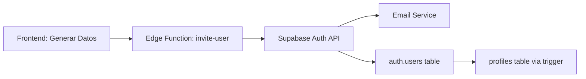

# Problema: Email Rate Limit en Generador de Datos Sintéticos

## Resumen Ejecutivo

El generador de datos sintéticos para el curso 2025-26 está fallando debido a un **rate limit de emails** impuesto por Supabase Auth. El sistema intenta crear 7 usuarios (2 profesores + 5 estudiantes) usando la Edge Function `invite-user`, pero Supabase bloquea las peticiones después de los primeros intentos.

**Estado actual**: ❌ BLOQUEADO  
**Impacto**: No se pueden generar datos sintéticos para QA/desarrollo  
**Prioridad**: ALTA

---

## Contexto Técnico

### Arquitectura Actual



### Flujo de Creación de Usuarios

1. **Frontend** llama a la Edge Function `invite-user` con:
   ```typescript
   {
     email: "user+SYNTH_25_26@example.com",
     password: "12345678",
     role: "PROF" | "ESTU",
     full_name: "Nombre [SYNTH_25_26]",
     skip_email: true  // ⚠️ Flag que debería evitar emails
   }
   ```

2. **Edge Function** (`invite-user`) procesa la petición:
   - Valida permisos (requiere rol ADMIN)
   - Llama a `supabase.auth.admin.createUser()`
   - Crea/actualiza el profile en `public.profiles`

3. **Supabase Auth** crea el usuario:
   - Inserta en `auth.users`
   - **Envía email de confirmación** (⚠️ PROBLEMA)
   - Trigger automático crea entrada en `profiles`

### Problema Identificado

**Supabase Auth está enviando emails de confirmación a pesar del flag `skip_email: true`**

**Evidencia:**
```
Error: email rate limit exceeded
Status: 400 Bad Request
Endpoint: /functions/v1/invite-user
```

**Rate Limit de Supabase:**
- **Límite**: ~3-4 emails por minuto (no documentado oficialmente)
- **Ventana**: 60 segundos
- **Comportamiento**: Bloquea peticiones subsiguientes con error 400

---

## Intentos de Solución Realizados

### ❌ Intento 1: Delay de 1 segundo entre usuarios
```typescript
// Añadir delay entre cada usuario
await new Promise(resolve => setTimeout(resolve, 1000));
```
**Resultado**: Insuficiente, el rate limit sigue activándose

### ❌ Intento 2: Batching por rol con delays largos
```typescript
// Crear profesores (2)
await createUsersInAuth(professors);
await new Promise(resolve => setTimeout(resolve, 2000));

// Crear estudiantes (5)
await createUsersInAuth(students);
await new Promise(resolve => setTimeout(resolve, 3000));
```
**Resultado**: Falla en el primer profesor, el rate limit ya está activo

### ❌ Intento 3: Flag `skip_email: true`
```typescript
body: JSON.stringify({
  email: user.email,
  password: '12345678',
  skip_email: true  // Debería evitar emails
})
```
**Resultado**: La Edge Function o Supabase Auth ignora este flag

---

## Análisis de Causa Raíz

### Posibles Causas

1. **Edge Function no respeta `skip_email`**
   - La Edge Function `invite-user` puede no estar pasando este flag a `createUser()`
   - Necesita revisión del código de la Edge Function

2. **Supabase Auth ignora `skip_email` en `createUser()`**
   - La API de Supabase Auth puede no soportar este parámetro
   - Documentación oficial no menciona `skip_email` para `admin.createUser()`

3. **Email confirmation automático**
   - Supabase puede tener configurado "Email confirmations" como obligatorio
   - Configuración en Dashboard → Authentication → Email Templates

4. **Rate limit acumulativo**
   - Intentos previos fallidos pueden haber agotado el límite
   - El rate limit puede tardar 5-10 minutos en resetear

---

## Soluciones Propuestas

### ✅ Solución 1: Crear usuarios directamente en SQL (RECOMENDADA)

**Ventajas:**
- Evita completamente el rate limit de emails
- Más rápido (sin delays)
- Control total sobre el proceso

**Implementación:**
```typescript
// 1. Generar usuarios sintéticos con UUIDs deterministas
const users = generateUsers(rng);

// 2. NO llamar a Edge Function, solo generar SQL
const sqlStatements = generateUserCreationSQL(users);

// 3. Mostrar SQL en UI para que el usuario lo ejecute manualmente
console.log('⚠️ Ejecuta este SQL en Supabase Dashboard:');
console.log(sqlStatements.join('\n'));

// 4. Continuar con el resto del seed (bloques, piezas, etc.)
```

**SQL generado:**
```sql
-- Crear usuario en auth.users
INSERT INTO auth.users (id, email, encrypted_password, email_confirmed_at, ...)
VALUES ('uuid', 'email', crypt('12345678', gen_salt('bf')), NOW(), ...);

-- Crear profile
INSERT INTO public.profiles (id, full_name, role, ...)
VALUES ('uuid', 'Nombre [SYNTH_25_26]', 'PROF', ...);
```

**Flujo:**
1. Usuario click "Generar"
2. Sistema genera SQL y lo muestra
3. Usuario copia SQL y lo ejecuta en Supabase Dashboard
4. Sistema continúa creando bloques, piezas, asignaciones, etc.

---

### ⚠️ Solución 2: Modificar Edge Function

**Objetivo**: Hacer que la Edge Function respete `skip_email`

**Cambios necesarios en `invite-user` Edge Function:**
```typescript
// supabase/functions/invite-user/index.ts

const { email, password, skip_email, ...metadata } = await req.json();

if (skip_email) {
  // Crear usuario SIN enviar email
  const { data, error } = await supabaseAdmin.auth.admin.createUser({
    email,
    password,
    email_confirm: true,  // Marcar como confirmado
    user_metadata: metadata,
    // NO incluir 'send_email' o similar
  });
} else {
  // Flujo normal con email
  const { data, error } = await supabaseAdmin.auth.admin.inviteUserByEmail(email);
}
```

**Riesgos:**
- Requiere modificar código de Edge Function
- Puede que Supabase Auth no permita crear usuarios sin email
- Necesita testing exhaustivo

---

### ⚠️ Solución 3: Deshabilitar Email Confirmations

**Pasos:**
1. Ir a Supabase Dashboard → Authentication → Providers
2. Deshabilitar "Confirm email" temporalmente
3. Generar datos sintéticos
4. Re-habilitar "Confirm email"

**Riesgos:**
- Afecta a TODOS los usuarios, no solo sintéticos
- Ventana de seguridad abierta durante la generación
- Fácil olvidar re-habilitar

---

### ⚠️ Solución 4: Esperar y reintentar

**Implementación:**
```typescript
async function createUsersWithRetry(users, maxRetries = 3) {
  for (let attempt = 0; attempt < maxRetries; attempt++) {
    try {
      return await createUsersInAuth(users);
    } catch (error) {
      if (error.message.includes('rate limit')) {
        console.log(`⏳ Rate limit hit, waiting 5 minutes (attempt ${attempt + 1}/${maxRetries})...`);
        await new Promise(resolve => setTimeout(resolve, 5 * 60 * 1000));
      } else {
        throw error;
      }
    }
  }
}
```

**Desventajas:**
- Proceso muy lento (5+ minutos por intento)
- Mala experiencia de usuario
- No garantiza éxito

---

## Recomendación Final

### Opción A: Híbrida (Corto Plazo)

1. **Generar SQL automáticamente** y mostrarlo en UI
2. **Usuario ejecuta SQL** en Supabase Dashboard
3. **Sistema continúa** con el resto del seed

**Ventajas:**
- Solución inmediata
- No requiere cambios en Edge Function
- Control total sobre usuarios

**Desventajas:**
- Requiere paso manual
- No es completamente automático

### Opción B: Edge Function Mejorada (Largo Plazo)

1. **Modificar Edge Function** para soportar `skip_email` correctamente
2. **Usar Service Role Key** en lugar de Admin API
3. **Implementar batch creation** con delays inteligentes

**Ventajas:**
- Solución permanente
- Totalmente automático
- Mejor para otros casos de uso

**Desventajas:**
- Requiere desarrollo adicional
- Testing exhaustivo necesario

---

## Información Adicional para el Equipo

### Archivos Relevantes

- **Generador**: `src/utils/seeds/syntheticSchoolYear2025_26.ts`
- **Edge Function**: `supabase/functions/invite-user/index.ts` (no visible en este repo)
- **UI Component**: `src/pages/admin/maintenance/components/SyntheticSchoolYearCard.jsx`
- **Cleanup SQL**: `cleanup-synthetic-data.sql`

### Configuración Actual

**Supabase Project**: `qvzxautxtgcebjpjfvcq`  
**Auth Settings**: (Revisar en Dashboard)
- Email confirmations: ¿Habilitado?
- Email rate limit: ~3-4/min (no configurable)
- Service Role Key: Disponible en `.env.local`

### Datos Técnicos

**Usuarios a crear**: 7 (2 PROF + 5 ESTU)  
**Password**: `12345678` (solo dev)  
**Email pattern**: `nombre.apellido+SYNTH_25_26@example.com`  
**Tag identificador**: `[SYNTH_25_26]` en `full_name`

### Logs de Error

```
POST https://qvzxautxtgcebjpjfvcq.supabase.co/functions/v1/invite-user
Status: 400 Bad Request
Response: { "message": "email rate limit exceeded" }
```

---

## Próximos Pasos

### Inmediatos (Hoy)

1. ✅ Documentar el problema (este documento)
2. ⏳ Decidir entre Opción A (SQL manual) u Opción B (Edge Function)
3. ⏳ Implementar solución elegida
4. ⏳ Probar generación completa

### Corto Plazo (Esta Semana)

1. Revisar código de Edge Function `invite-user`
2. Verificar configuración de Auth en Supabase Dashboard
3. Considerar usar Service Role Key directamente
4. Documentar proceso final en README

### Largo Plazo (Próximo Sprint)

1. Implementar solución permanente
2. Añadir tests automatizados
3. Mejorar manejo de errores y UX
4. Considerar alternativas a Edge Functions

---

## Contacto y Recursos

**Documentación Supabase:**
- [Auth Admin API](https://supabase.com/docs/reference/javascript/auth-admin-createuser)
- [Edge Functions](https://supabase.com/docs/guides/functions)
- [Rate Limiting](https://supabase.com/docs/guides/platform/going-into-prod#rate-limiting)

**Soporte:**
- Supabase Discord: https://discord.supabase.com
- GitHub Issues: https://github.com/supabase/supabase/issues

---

**Documento creado**: 2025-12-21 04:29 CET  
**Autor**: Sistema de generación de datos sintéticos  
**Versión**: 1.0
